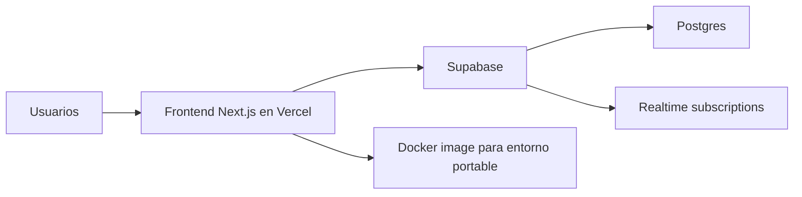

# PlayPoll

> Una app en tiempo real para decidir que jugar con amigos en pocos minutos.

PlayPoll es un MVP funcional orientado a sesiones casuales entre amigos: una persona crea una sala, comparte el link, cada jugador propone opciones, todos votan en vivo y, si hay empate, la ruleta define el ganador.

El proyecto nacio como una app fullstack liviana con foco en experiencia realtime. Actualmente tambien se esta profesionalizando desde el lado DevOps para mostrar una evolucion clara de producto + operacion.

## Demo y estado actual

- Deploy principal: Vercel
- Backend realtime y persistencia: Supabase
- Estado del producto: MVP funcional y estable
- Estado DevOps actual: Docker foundation cerrada, documentacion en progreso

## Que hace

- Crea salas y genera links para invitar jugadores
- Permite ingresar con nickname y avatar
- Recibe propuestas de juegos sin duplicados
- Actualiza jugadores, propuestas y votos en tiempo real
- Resuelve empates con una ruleta final

## Stack

- Next.js 14
- React 18
- TypeScript
- Tailwind CSS
- Supabase
- Docker

## Arquitectura actual



### Como esta organizado hoy

- `app/`: rutas y layout de Next.js App Router
- `components/`: UI y logica cliente de las salas
- `lib/`: cliente de Supabase y utilidades
- `public/`: imagenes, favicons, avatars y sonidos

### Nota arquitectonica importante

Hoy la logica critica del flujo de juego sigue en cliente porque PlayPoll esta priorizando simplicidad de MVP. La linea de trabajo actual no busca re-arquitecturar eso todavia, sino mejorar entrega, portabilidad, trazabilidad y calidad operativa del repositorio.

## Variables de entorno

Crea un archivo `.env.local` a partir de `.env.example`:

```env
NEXT_PUBLIC_SUPABASE_URL=tu_url
NEXT_PUBLIC_SUPABASE_ANON_KEY=tu_anon_key
```

## Desarrollo local

```bash
npm install
npm run dev
```

La app queda disponible en `http://localhost:3000`.

## Docker

La imagen usa:

- build multi-stage
- `next build` con salida `standalone`
- usuario no root en runtime
- `sharp` instalado para compatibilidad con el build de Next.js

### Build de imagen

```bash
docker build \
  --build-arg NEXT_PUBLIC_SUPABASE_URL=tu_url \
  --build-arg NEXT_PUBLIC_SUPABASE_ANON_KEY=tu_anon_key \
  -t playpoll:local .
```

### Ejecutar contenedor

```bash
docker run --rm -p 3000:3000 playpoll:local
```

### Notas de ejecucion

- El contenedor expone el puerto `3000`
- Las variables `NEXT_PUBLIC_SUPABASE_URL` y `NEXT_PUBLIC_SUPABASE_ANON_KEY` se inyectan en build
- El endpoint `GET /api/health` devuelve una señal minima de salud del proceso web
- El `HEALTHCHECK` del contenedor consulta `http://127.0.0.1:3000/api/health`
- El despliegue productivo principal sigue estando en Vercel

## Estrategia de despliegue actual

- Desarrollo local con Node.js
- Validacion de portabilidad con Docker
- Deploy productivo serverless con Vercel
- Servicios de datos y realtime delegados a Supabase

Esta combinacion es deliberada: permite mantener bajo el costo operativo del MVP mientras se mejora el flujo de entrega del repositorio.

## Flujo de trabajo del repo

- `main` representa la linea estable
- las mejoras se trabajan por fases chicas y controladas
- cada fase busca una PR acotada y facil de defender
- primero se valida localmente, despues se sube

## Roadmap DevOps

Fases previstas:

1. Docker foundation
2. Documentacion Docker y arquitectura
3. CI con GitHub Actions
4. Branch protection
5. Health endpoint y Docker `HEALTHCHECK`
6. Dependabot y CodeQL
7. Smoke test minimo
8. Documentacion de operacion y observabilidad

## Objetivo de portfolio

Este repo no busca aparentar complejidad artificial. La idea es mostrar decisiones realistas sobre un producto pequeno:

- containerizacion portable
- automatizacion gradual
- seguridad incremental
- documentacion operativa
- buenas practicas de entrega sin sobreingenieria
