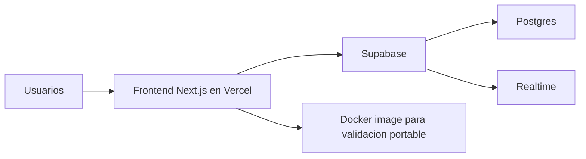

# PlayPoll

PlayPoll es una app web en tiempo real para resolver rapido una pregunta comun entre amigos: que jugar.

Una persona crea una sala, comparte el link, cada jugador propone opciones, todos votan en vivo y, si hay empate, la ruleta define el ganador.

## Proyecto

Este repositorio muestra dos cosas al mismo tiempo:

- un MVP funcional construido con Next.js y Supabase
- una evolucion DevOps incremental, pensada para portfolio, sin sobreingenieria

El foco no esta en aparentar complejidad, sino en mostrar buenas decisiones de entrega, portabilidad, automatizacion y operacion sobre un proyecto chico y real.

## Que se puede hacer

- crear salas y compartir un link
- ingresar con nickname y avatar
- proponer juegos sin duplicados
- votar en tiempo real
- resolver empates con una ruleta final

## Stack

- Next.js 14
- React 18
- TypeScript
- Tailwind CSS
- Supabase
- Docker
- GitHub Actions
- Vercel

## Arquitectura



## Como correrlo

### Variables de entorno

Usa `.env.example` como base y crea un archivo `.env.local`:

```env
NEXT_PUBLIC_SUPABASE_URL=tu_url
NEXT_PUBLIC_SUPABASE_ANON_KEY=tu_anon_key
```

### Desarrollo local

```bash
npm install
npm run dev
```

La app queda disponible en `http://localhost:3000`.

### Docker

Build de imagen:

```bash
docker build \
  --build-arg NEXT_PUBLIC_SUPABASE_URL=tu_url \
  --build-arg NEXT_PUBLIC_SUPABASE_ANON_KEY=tu_anon_key \
  -t playpoll:local .
```

Ejecutar contenedor:

```bash
docker run --rm -p 3000:3000 playpoll:local
```

## Estado DevOps actual

El proyecto ya incluye:

- Docker multi-stage con runtime no root
- `.env.example` para onboarding
- CI con GitHub Actions para lint, typecheck, build y docker build
- branch protection sobre `main`
- endpoint `GET /api/health`
- `HEALTHCHECK` en Docker
- Dependabot y CodeQL
- deploy y previews en Vercel

## Operacion

Para troubleshooting y operacion basica:

- runbook operativo: [docs/operations.md](docs/operations.md)

Ese documento cubre:

- que valida CI
- que valida `/api/health`
- que mirar si falla Docker
- que mirar si falla Vercel
- limites actuales de observabilidad del MVP

## Enfoque del proyecto

PlayPoll sigue siendo un MVP. La logica critica del flujo de juego hoy vive mayormente en cliente, y eso es una decision consciente para mantener simple el producto en esta etapa.

La parte interesante de este repositorio es que el proyecto fue mejorado por capas:

- primero portabilidad
- despues documentacion
- despues CI
- despues proteccion de ramas
- despues health checks
- despues seguridad y runbooks

Eso lo vuelve util para mostrar criterio tecnico, no solo codigo funcional.
